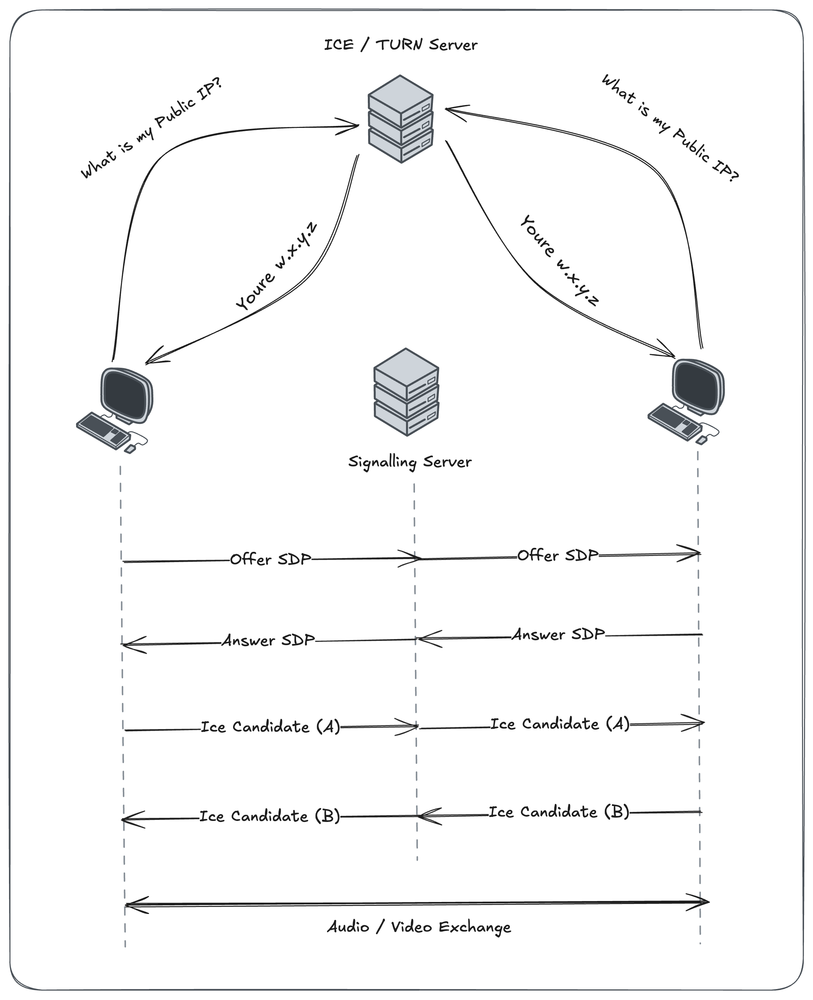
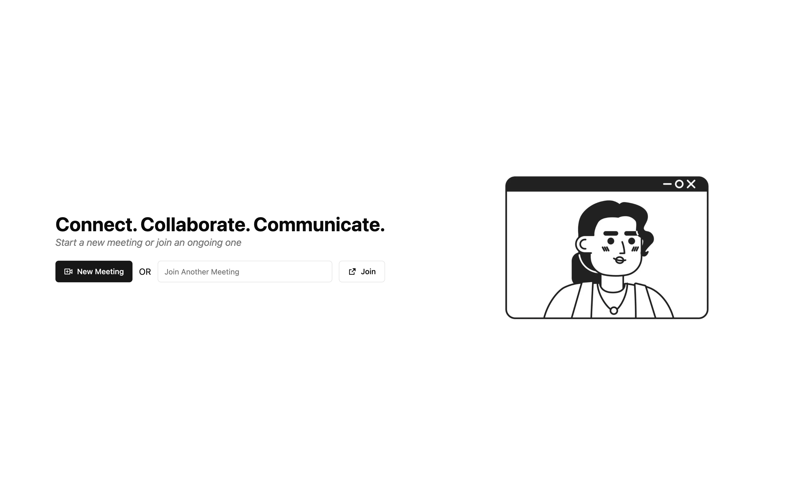
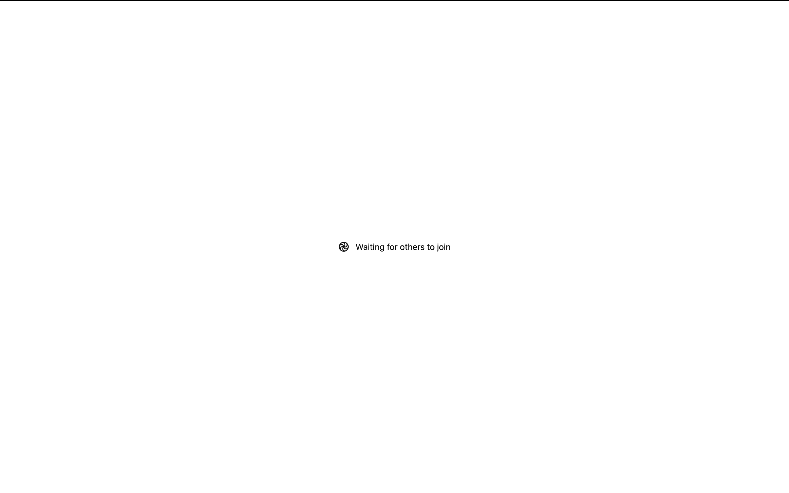
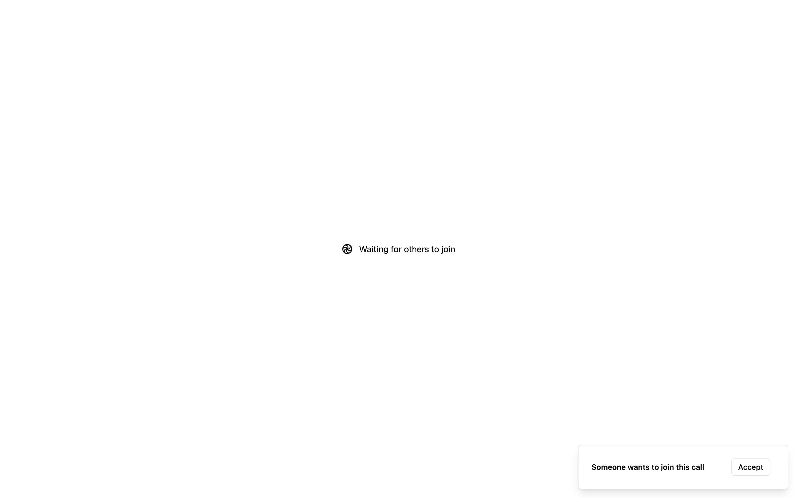
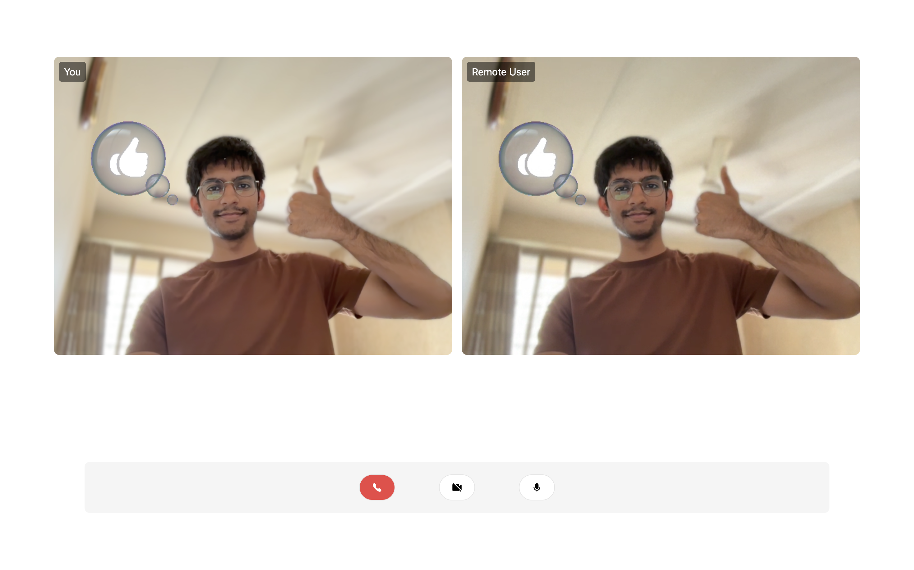

<!-- Header

    <h1>Real-Time Audio & Video Communication with WebRTC</h1>

A fully functional WebRTC-based real-time communication platform, supporting peer-to-peer video and audio calls with features like dynamic room creation, signaling via Socket.IO, and ICE candidate handling for seamless connectivity.

## Architecture

    

## Screenshots

    
    
    
    

## Tech Used

    
    
    
    
    

---

    Made with ♥️ by
    <a href="https://github.com/ArnavGuptaaa">Nav</a>.

 -->
